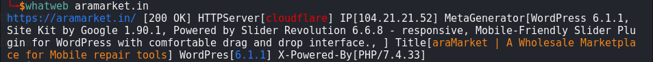

# webanalyser (Created By Bhavya & Thanuja)

Next generation web scanner


## Installation

```sh
git clone https://github.com/Thanujamv05/webanalyzer
ls
cd webanalyzer
chmod +x *
pip install -r requirements.txt
python3 setup.py
python3 webanalyzer.py "target url"
```


## Demo


